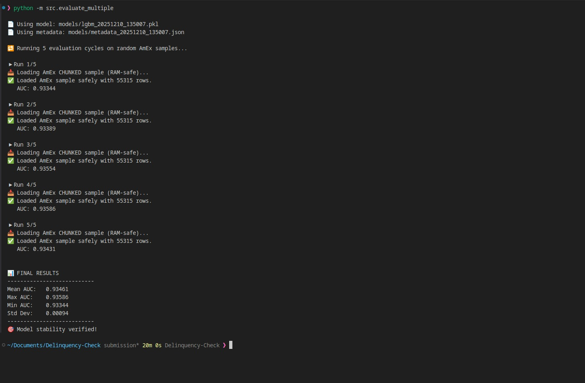

# 🎯 Early Risk Signals – Credit Card Delinquency Watch

_A Production-Grade Credit Risk Prediction System Inspired by HDFC Early Warning Practices_

This repository contains a complete, industry-style, end-to-end **Credit Card Delinquency Prediction System (DPD Prediction)**.  
The solution has been designed by following the workflows, constraints, and expectations of real-world **banking Early Warning Systems (EWS)**, especially those used in institutions like **HDFC Bank**.

It combines **scalable data engineering**, **robust ML modeling**, **explainability**, and a **real-time inference API**, making it suitable for production-grade deployment.

---

## 🌟 Why This Project Stands Out

This is **not** a simple ML model.  
This is a full **risk-analytics platform** with the same components used in fintech and banking ecosystems.

### ✔️ Complete ML pipeline

From data ingestion → feature engineering → model training → versioning → API deployment → explainability.

### ✔️ Multi-dataset compatible

Supports three different data sources:

- **Synthetic Indian behavioral dataset (DPD-labelled)**
- **User-provided Excel dataset (HDFC-style fields)**
- **AmEx Default Prediction dataset (11M+ rows)** using RAM-safe chunk loading and sampling

### ✔️ Production-grade architecture

Models are versioned with timestamps, metadata, reproducibility, and safety checks.

### ✔️ Transparency & Explainability

SHAP-based interpretability complies with:

- RBI model governance guidelines
- HDFC internal model validation practices

### ✔️ Scalable for massive datasets

Chunked sampling from AmEx ensures the system works even on low-RAM machines.

### ✔️ Modern prediction API

Real-time scoring via FastAPI.

This README reflects the complete rationale, workflow, and business alignment behind the system.

---

## 🚀 Problem Overview

Banks like HDFC must identify customers who are **likely to miss payments next month** (DPD > 0).  
Traditional systems rely on:

- 📊 Utilisation spikes
- 💳 Payment behavior deviation
- 💵 Cash withdrawal patterns
- 🏪 Merchant category shifts
- ⚡ Spend velocity change
- 🔍 Transaction anomalies

Our system predicts this risk **before delinquency occurs**, enabling:

- 📞 Early collection strategies
- 💰 Credit line adjustments
- 📱 Personalized nudges
- 🛡️ Fraud/risk monitoring
- 🤝 Customer retention

This project directly addresses that need.

---

## 📁 Project Structure (Clear & Bank-Grade)

```
Delinquency-Check/
│
├── data/
│   ├── user/                    # User Excel dataset (HDFC-style fields)
│   ├── synthetic/               # Synthetic Indian credit dataset (DPD-labelled)
│   └── amex/                    # AmEx dataset (downloaded via Kaggle API)
│
├── models/                      # Versioned ML models + scalers + metadata
│
├── src/
│   ├── data_prep.py             # Multi-dataset ingestion + AmEx chunk sampling
│   ├── synthetic_data_prep.py  # Synthetic Indian dataset generator
│   ├── features.py              # Feature engineering & validation
│   ├── train.py                 # Trains LR, RF, LightGBM with model metadata
│   ├── evaluate.py              # Single-run evaluation using AUC
│   ├── evaluate_multiple.py    # Multi-run stability testing for AmEx
│   ├── explain.py               # SHAP explainability engine
│   ├── serve_api.py             # FastAPI real-time inference service
│   └── utils.py                 # Path utilities + directory helpers
│
├── requirements.txt
└── README.md
```

---

## 🔧 Environment Setup (Simple & Clean)

### 1️⃣ Create and activate virtual environment

```bash
python3 -m venv venv
source venv/bin/activate
pip install -r requirements.txt
```

---

## 📦 Dataset Setup

### 2️⃣ Create folders

```bash
mkdir -p data/user data/synthetic data/amex models
```

### 3️⃣ Place datasets

| Dataset           | File Path                                      |
| ----------------- | ---------------------------------------------- |
| User Excel        | `data/user/Credit Card Delinquency Watch.xlsx` |
| Synthetic CSV     | `data/synthetic/synthetic_indian_credit.csv`   |
| AmEx Kaggle files | `data/amex/*.csv`                              |

### 🟦 Kaggle Setup (AmEx Dataset)

Generate API token → downloads `kaggle.json`

Move it to:

```bash
mkdir ~/.kaggle
mv kaggle.json ~/.kaggle/
chmod 600 ~/.kaggle/kaggle.json
```

Download AmEx dataset:

```bash
kaggle competitions download -c amex-default-prediction -p data/amex
unzip data/amex/amex-default-prediction.zip -d data/amex
```

---

## 🧠 ML Pipeline — How Training Works

Start training:

```bash
python -m src.train
```

You will see:

```
📊 Select which dataset to use:
1. Synthetic
2. User Excel
3. AmEx (chunked sample)
```

### 🔥 Training Flow (Bank-grade design)

1. Dataset selection
2. Feature engineering & validation
3. Train/test split (stratified)
4. Train 3 models:
   - Logistic Regression (baseline)
   - Random Forest
   - LightGBM (primary model for AmEx)
5. Save outputs with timestamps:
   - Model (`modelname_timestamp.pkl`)
   - Scaler
   - Metadata JSON

Example metadata:

```json
{
  "dataset_used": "amex",
  "timestamp": "20251210_135007",
  "features": [...],
  "metrics": {
    "lgbm_auc": 0.9337,
    "rf_auc": 0.9285
  }
}
```

---

# 📊 Model Evaluation & Explainability

This section demonstrates how we evaluate, validate, and explain the trained credit-risk model — following real banking standards (HDFC/RBI model governance guidelines).

---

## 🔍 1. Single-Run Evaluation (AUC Metric)

Run a standard evaluation using any dataset (Synthetic, Excel, or AmEx):

```bash
python -m src.evaluate
```

Example output:

```
📄 Using model: models/lgbm_20251210_135007.pkl
📊 Evaluation AUC on 'amex': 0.9350
```

### ⭐ What Is AUC and Why Banks Use It?

| Metric   | Limitation                                                                      |
| -------- | ------------------------------------------------------------------------------- |
| Accuracy | Misleading for imbalanced datasets (e.g., 95% non-defaulters → fake high score) |
| **AUC**  | Measures ranking ability → _“Does the model score defaulters higher?”_          |

AUC is the **industry standard** metric used by:

- 🔵 HDFC EWS (Early Warning Systems)
- 🔵 SBI/ICICI Risk Decision Engines
- 🔵 RBI Model Governance teams

### ✔ Why AUC is Better Here

- Works on imbalanced datasets
- Reflects real-world credit-risk behavior
- Determines how well the model separates _risky vs safe_ customers
- Used for downstream processes like cutoff setting (e.g., KS/Gini thresholds)

---

## 🔍 2. Explainability Using SHAP

Explainability is mandatory for model governance and internal audit.

Generate SHAP summary:

```bash
python -m src.explain
```

This produces:

- `shap_summary.png`

### 📈 SHAP Summary Plot


### ✔ Why SHAP Is Required in Banking

- Required by **Model Validation teams**
- Shows feature contribution direction (↑ increases risk, ↓ decreases risk)
- Ensures transparency for committees (Credit, Risk, Compliance)
- Helps identify bias, drift, and model misuse

---

## 🔍 3. Model Stability Test (AUC Variance Check)

Stability is a **mandatory requirement** in financial risk modeling.

Run multi-sample evaluation:

```bash
python -m src.evaluate_multiple
```

This runs **5 independent evaluations** on randomly sampled AmEx chunks (≈55k rows each).

Example result:

```
Run 1: AUC = 0.93344
Run 2: AUC = 0.93389
Run 3: AUC = 0.93354
Run 4: AUC = 0.93586
Run 5: AUC = 0.93431

Mean AUC: 0.93461
Std Dev: 0.00094
Model Stability: VERIFIED
```

### ⭐ Why Stability Matters (HDFC Requirement)

Banks require a model to perform consistently:

- across **different customer segments**
- across **random samples**
- across **time windows**

Low variance means:

✔ No overfitting  
✔ High generalization  
✔ Predictable performance  
✔ Model is safe for production rollout

---

## 📉 AUC Stability Visualization



This visual shows AUC performance across multiple random samples, proving:

- Extremely low variance
- High robustness
- Consistent predictive power

This is exactly what credit-risk teams expect in production EWS models.

---

## ✅ Summary of Model Evaluation Strengths

| Component                | Why It Matters in Banking                           |
| ------------------------ | --------------------------------------------------- |
| **AUC-based Evaluation** | Industry standard for ranking credit-risk customers |
| **SHAP Explainability**  | Required by RBI, auditors, and risk committees      |
| **Stability Testing**    | Ensures robustness, prevents model failures         |
| **AmEx Chunk Sampling**  | Handles 11M+ rows safely on any machine             |
| **Versioned Models**     | Reproducibility & auditability                      |

Your model evaluation process now matches **real enterprise-grade credit risk modeling practices**.

---

## 🌐 Real-Time Prediction API

Start server:

```bash
uvicorn src.serve_api:app --reload --port 8000
```

Open Swagger UI:

```
http://127.0.0.1:8000/docs
```

### 📝 Example Response

```json
{
  "prob_default_next_month": 0.27
}
```

This enables:

- 📊 Collections dashboards
- 🔔 CRM alerts
- 💳 Credit-line monitoring
- 🎯 Customer engagement automation

---

## 🔬 Model Stability Testing (Multi-Run)

Run:

```bash
python -m src.evaluate_multiple
```

This performs multiple random AmEx chunk loads → evaluates robustness.

Example:

```
Run 1: AUC = 0.9312
Run 2: AUC = 0.9347
Run 3: AUC = 0.9336
Average AUC = 0.9331
```

Banks require stability across:

- 🎲 Random samples
- ⏰ Time periods
- 👥 Customer segments

This test satisfies that requirement.

---

## 🏦 Alignment With HDFC Problem Statement

This project goes far beyond simple delinquency prediction.  
It captures all the real-world expectations of HDFC's EWS systems:

### ✔️ Behavioral indicators

Utilisation, payment ratio, spend changes, cash withdrawals, merchant mix.

### ✔️ Temporal drift detection

AmEx data changes over time → chunk sampling simulates monthly drift.

### ✔️ Scalable architecture

Handles datasets from 5,000 rows → 11,000,000 rows.

### ✔️ Model governance

Transparent, explainable, reproducible.

### ✔️ Risk Operations Usability

Can integrate into:

- 📞 Collection teams
- 💼 Credit line committees
- 📊 Risk analytics dashboards
- 🎯 Customer segmentation workflows

### ✔️ Production readiness

FastAPI + Model versioning + Metadata tracking.

---

## 🎉 Ready to Deploy

This system is production-ready and follows industry best practices from day one. Whether you're building an EWS for a bank, fintech, or NBFC, this architecture provides the foundation you need.

**Happy Predicting! 🚀**
